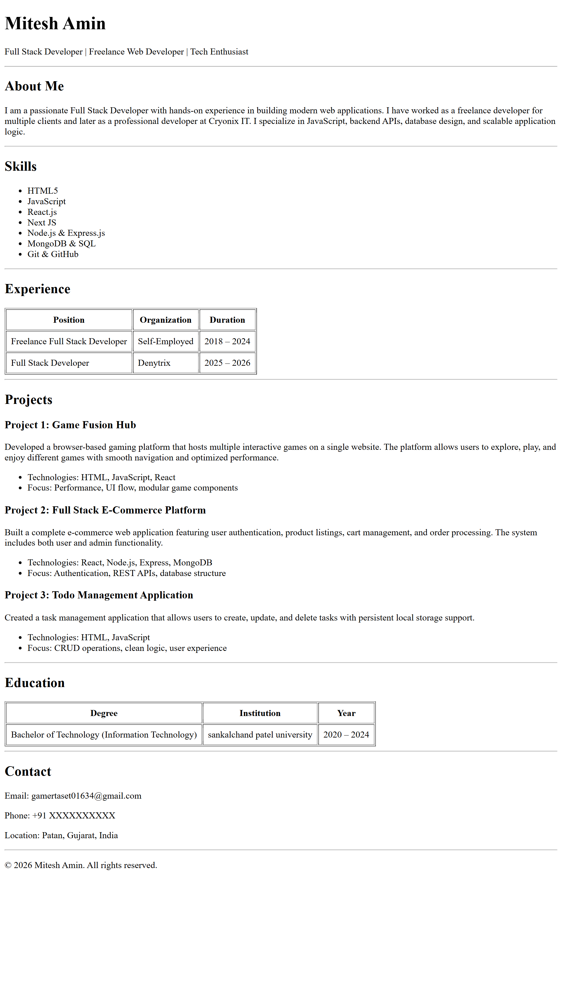

# HTML Resume Website

A single-page resume website built using **pure HTML only**, without any CSS or JavaScript.
This project demonstrates proper HTML structure, semantics, and clean layout using
headings, lists, tables, and sections.

---

## 📌 Features

- Single-page resume layout
- HTML-only implementation (no CSS, no JS)
- Clean and readable structure
- Sections for About, Skills, Experience, Projects, Education, and Contact
- Table-based alignment for experience and education
- Disclaimer included for public repository safety

---

## 🛠️ Technologies Used

- HTML5

---

## ▶️ How to Run the Project

1. Clone this repository
2. Open the `index.html` file in any modern web browser
3. No additional setup is required

---

## 📸 Screenshot

---

## ⚠️ Disclaimer

This project is created for educational and demonstration purposes only.
All personal details, project descriptions, and contact information used in this
website are sample data. Since this repository is public, no real personal
information has been shared.

---

## 📄 License

This project is open for educational use and learning purposes.
